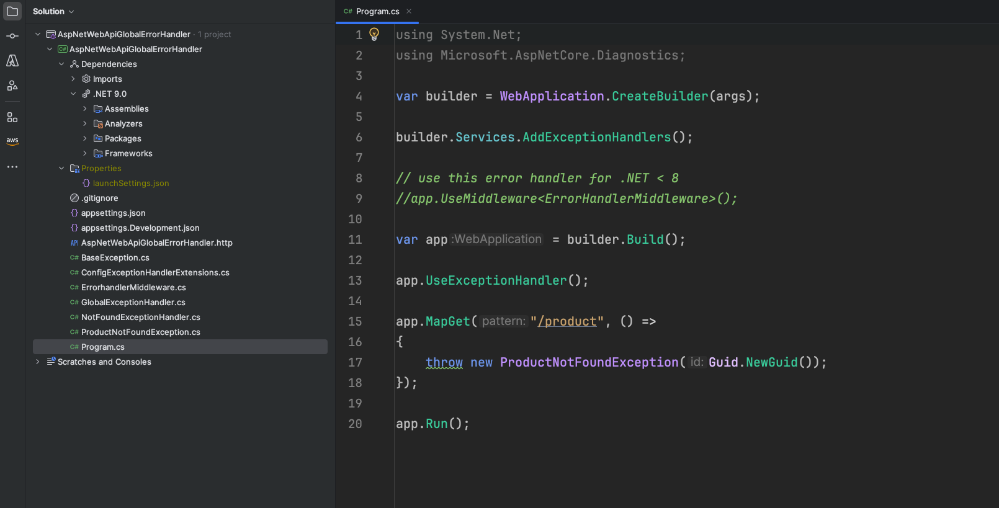

# GlobalExceptionHandlerforWebApI (Demo App)

This GitHub repository GlobalExceptionHandlerforWebApI demonstrates how to implement a global error handling pattern in 
ASP.NET Web API applications. By setting up a centralized mechanism to catch and process exceptions, developers can ensure consistent error responses and improve application reliability. This approach simplifies maintenance and enhances the user experience by providing uniform error handling across the entire application.

### Credits

* ASP.NET Core Minimal API: https://learn.microsoft.com/en-us/aspnet/core/fundamentals/minimal-apis/overview?view=aspnetcore-9.0
* .NET 9: https://learn.microsoft.com/en-us/dotnet/core/whats-new/dotnet-9/overview

